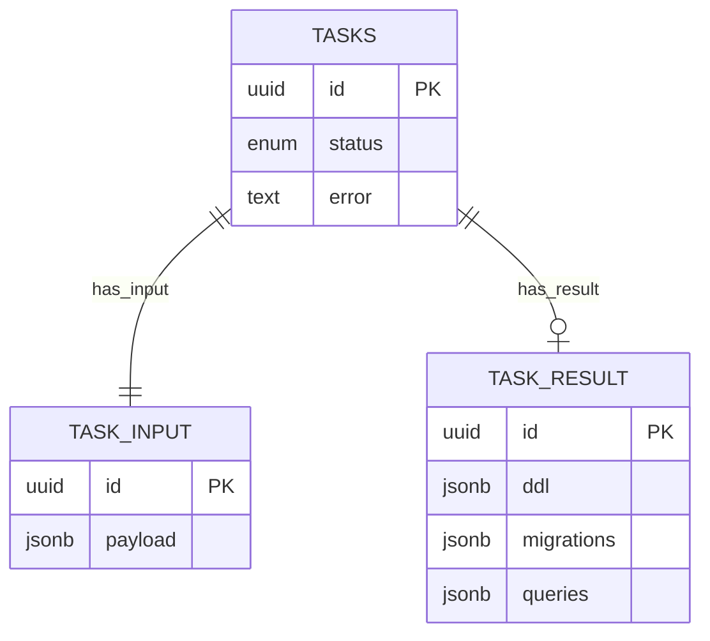

# Vibe Data — AI-агент оптимизации SQL для Trino + Iceberg

**Vibe Data** — это сервис-агент на базе LLM, который принимает описание схемы данных (DDL), набор часто выполняемых
SQL-запросов со статистикой и строку подключения JDBC, анализирует их и возвращает:

* новый набор DDL для улучшенной структуры,
* миграции (`INSERT ... SELECT ...`) для переноса данных,
* переписанные запросы (с сохранением `queryid`).

Основная цель — **ускорение аналитических запросов и снижение стоимости хранения** в lakehouse-стеке (Trino + Iceberg +
S3) и других СУБД.

---

## Цели и задачи

* Сокращение среднего времени выполнения запросов за счёт:

    * денормализации,
    * партиционирования и сортировки,
    * переписывания SQL.
* Снижение затрат на хранение через миграции и структурные изменения.
* Автоматизация работы DBA/Data Engineers с помощью LLM + эвристик.
* Поддержка требований ТЗ конкурса:

    * полный путь к объектам `<catalog>.<schema>.<table>`,
    * `CREATE SCHEMA` первым в DDL,
    * сохранение исходного `queryid`.

---

## Архитектура и стек

**Технологический стек:**
Java 21, Spring Boot 3, Spring AI, PostgreSQL, Docker, Trino JDBC.

**Основные компоненты:**

1. **REST API** (Spring Boot): эндпойнты `/new`, `/status`, `/getresult`, валидация DTO, OpenAPI-спека.
2. **Оркестратор задач**: JPA + PostgreSQL, статусы RUNNING/DONE/FAILED, асинхронная обработка (ThreadPool + @Async).
3. **LLM-агент (QueryOptimizerAgent)**:

    * сортировка запросов по весу (`runquantity * executiontime`),
    * итеративная оптимизация запросов,
    * использование инструментов `EXPLAIN LOGICAL`, `DISTRIBUTED`, `IO`, `ANALYZE`, `ANALYZE VERBOSE` через JDBC.
4. **Генератор артефактов**:

    * собирает новые DDL,
    * генерирует миграции,
    * формирует переписанные запросы.
5. **Хранилище**: таблицы `tasks`, `task_input`, `task_result` с JSONB для артефактов.
6. **Безопасность**: HTTP Basic Auth, параметры берутся из `application.properties`.

---

## API

### Эндпойнты

* **POST `/new`** — запуск задачи.
  Вход:

  ```json
  {
    "url": "jdbc:trino://host:port/catalog/schema?user=xxx&password=yyy",
    "ddl": [ { "statement": "CREATE TABLE ..." } ],
    "queries": [
      { "queryid": "uuid", "query": "SELECT ...", "runquantity": 123, "executiontime": 42 }
    ]
  }
  ```

  Выход: `{ "taskid": "uuid" }`.

* **GET `/status?task_id=...`** — статус: `RUNNING | DONE | FAILED`.

* **GET `/getresult?task_id=...`** — результат:

  ```json
  {
    "ddl": [ { "statement": "..." } ],
    "migrations": [ { "statement": "INSERT ..." } ],
    "queries": [ { "queryid": "uuid", "query": "SELECT ..." } ]
  }
  ```

### Ограничения ТЗ

* Таймаут на ответ сервиса: **15 минут**.
* Проверка идёт строго в порядке: DDL → migrations → queries.

---

## Алгоритм работы

1. Получение входа: DDL, список запросов, jdbc url.
2. Инспекция и сортировка запросов по весу.
3. Оптимизация каждого запроса через LLM и Trino EXPLAIN/ANALYZE.
4. Генерация финальных DDL и миграций.
5. Сохранение результата и выдача клиенту.

---

## Схема БД

