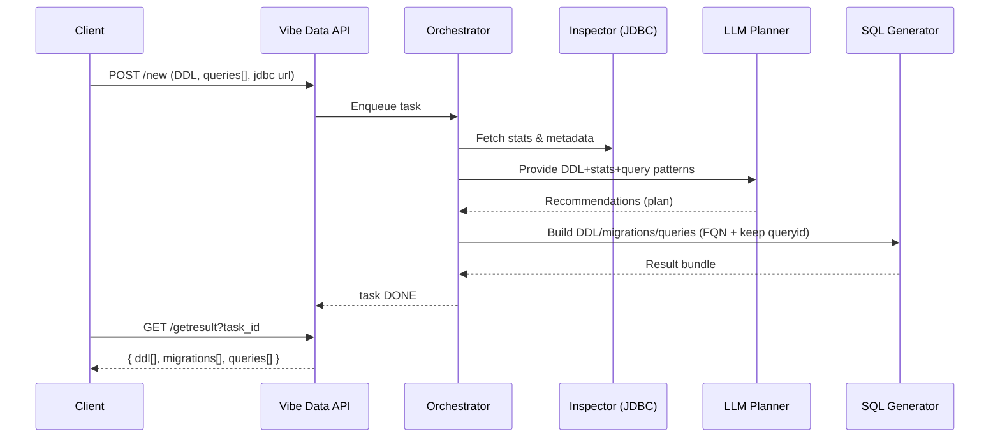
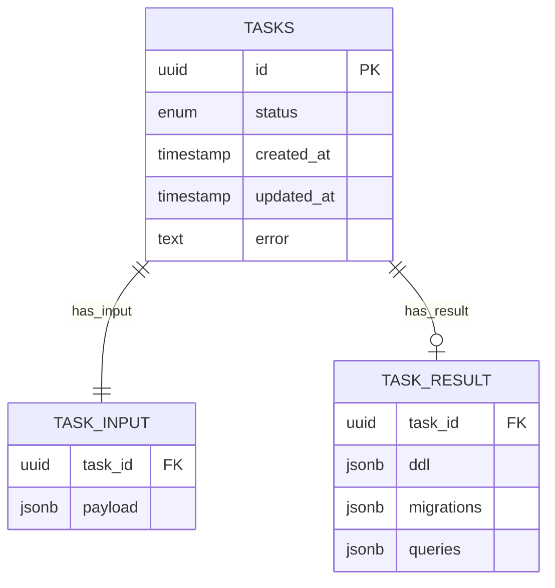

# Vibe Data — AI-агент оптимизации структуры БД и SQL-запросов

*Vibe Data* — это AI-агент, который принимает описание схемы данных, набор часто используемых SQL-запросов и строку подключения к источнику, анализирует паттерны запросов и статистику данных и возвращает рекомендации в виде нового набора DDL, миграций и переписанных запросов для ускорения аналитики и снижения стоимости хранения. Сервис разработан для работы в сценариях data lakehouse и традиционных СУБД.&#x20;

---

## Цели проекта

* Сократить среднее взвешенное время выполнения запросов за счёт рекомендаций по схеме (денормализация, партиционирование и т. п.) и переписыванию SQL.
* Снизить объёмы хранения через изменения форматов/структур и миграции.
* Автоматизировать трудоёмкую ручную оптимизацию за счёт применения LLM и встроенных эвристик.
* Поддержать типичные lakehouse-стэки (S3/Iceberg/Trino/Spark) и JDBC-подключения, предоставляемые организатором.

> **Важно:** все команды работы с таблицами в ответе сервиса должны использовать **полный путь** `<каталог>.<схема>.<таблица>`, а **первой DDL-командой** должна идти `CREATE SCHEMA` в нужном каталоге. Это правило также распространяется на все миграции и переписанные запросы.

---

## Архитектура и стек

**Стек:** Java 21, Spring Boot 3, Spring AI, PostgreSQL, Docker/Docker Compose.

**Ключевые компоненты:**

1. **REST API** (Spring Boot): принимает задания, отдаёт статусы и результаты; OpenAPI-документация встроена.
2. **Оркестратор задач**: очередь/пул воркеров, транзакции и ретраи (PostgreSQL + Spring).
3. **Инспектор источника**: JDBC-модуль для чтения метаданных/примерной статистики (кардинальности/размеров). Для Trino использует предоставленную строку подключения.
4. **Планировщик оптимизаций (LLM)**: Spring AI + промпт-шаблоны. Объединяет эвристики (join-graph, частоты, «горячие» агрегаты) и вывод LLM.
5. **Генератор SQL артефактов**: DDL новой схемы, миграции, переписанные запросы. Гарантирует FQN для таблиц и сохранение `queryid`.
6. **Хранилище артефактов**: JSONB поля для входа/выхода, статусов и логов.

Диаграмма последовательности (схематично):



---

## API

Сервис обязан поддерживать следующий набор эндпойнтов и форматы, указанные в ТЗ.

### Обзор эндпойнтов

* **POST `/new`** — запуск задачи анализа (асинхронно). На вход: `jdbc url`, `ddl[]`, `queries[]`. На выход: `taskid`.
* **GET `/status?task_id=...`** — статус: `RUNNING` / `DONE` / `FAILED`. Для проверки задан **предел ожидания ответа** (см. ниже).
* **GET `/getresult?task_id=...`** — получение результата: `ddl[]`, `migrations[]`, `queries[]`.

> Для промежуточной/финальной сдачи: требуется доступный `endpoint` и соблюдение предельного времени ожидания ответа **15 минут**.

### OpenAPI (YAML)

[OpenAPI спецификация сервиса](docs/openapi/swagger.yaml)

**Замечания по совместимости с ТЗ:**

* Форматы ввода/вывода эквивалентны образцам ТЗ; сервис возвращает `taskid` на запуск.
* Статусы строго: `RUNNING|DONE|FAILED`; при интеграционном чекере организаторов используется предельное ожидание на статус-вызов.
* В `ResultResponse.queries[]` сохраняется исходный `queryid` — без этого запрос не будет проверен.

### Примеры вызова

```bash
# Запуск задачи
curl -X POST http://{host}/new \
  -H 'Authorization: Basic ...' -H 'Content-Type: application/json' \
  -d @payload.json

# Проверка статуса
curl "http://{host}/status?task_id=6c12bd3f-80b1-4c0a-84ab-d3160d2e8f7a"

# Получение результата
curl "http://{host}/getresult?task_id=6c12bd3f-80b1-4c0a-84ab-d3160d2e8f7a"
```

---

## Алгоритм работы и требования к результату

1. **Сбор входа**: DDL (по таблицам), список запросов с частотами (`runquantity`) и `jdbc url`.
2. **Инспекция данных**: подключение к источнику через JDBC (в т. ч. Trino) для оценки состава и структуры.
3. **Анализ паттернов**: выделение часто соединяемых таблиц, дорогих агрегатов, а также типовых OLAP-шаблонов.
4. **Планирование изменений (LLM + эвристики)**: предложения по денормализации/партиционированию/типам данных и переписыванию запросов.
5. **Генерация артефактов**:

   * **DDL** с явным `CREATE SCHEMA` первым шагом и FQN для всех объектов,
   * **migrations** — перелив данных из оригинальных таблиц в новые,
   * **queries** — переписанные SQL с сохранённым `queryid`.
6. **Валидация**: синтаксис, FQN-проверка, наличие `queryid`, базовая симуляция плана (по возможности).

---

## Критерии оценки эффективности (метрики)

При проверке организаторы выполняют **DDL → migrations → запросы** в указанном порядке; измерение длительности ведётся по переписанным запросам, при этом **сохранение исходного `queryid` обязательно**.

**Метрика времени** (x):

$$
x = \frac{\sum_{i=1}^{n} Q_i \cdot \frac{A_i}{T_i}}{\sum_{i=1}^{n} Q_i}
$$

где $A$ — исходное время, $T$ — время после изменений, $Q$ — частота, $n$ — число операций. При проверке действует таймаут **10 минут на запрос** (ошибка = 10 минут).

**Метрика ресурсов** (y):

$$
y = \frac{S}{C}
$$

где $S$ — объём до оптимизации, $C$ — после.

**Итоговая оценка** (z):

$$
z = x \cdot \sqrt[3]{y}
$$

Чем выше $z$, тем лучше.

**Нефункциональные ограничения интеграции:** для внешних проверок установлен **предел ожидания ответа 15 минут** на endpoint. Для запроса статуса в ТЗ указано предельное ожидание, по истечении которого считается неудачей. 

---

## Контракты на выходные артефакты

* **DDL**:

  * Первая команда: `CREATE SCHEMA <каталог>.<новая_схема>`;
  * Все таблицы/индексы/материализованные представления — только с FQN.
* **Migrations**:

  * Только FQN в `INSERT INTO ... SELECT ...` из старых таблиц в новые.
* **Queries**:

  * Сохранить `queryid`; все обращения к новым таблицам — по FQN.

---

## Модель данных сервиса

* `tasks(id uuid, status enum, created_at, updated_at, error text)`
* `task_input(task_id fk, payload jsonb)` — исходные `url`, `ddl[]`, `queries[]` (валидируются).
* `task_result(task_id fk, ddl jsonb, migrations jsonb, queries jsonb)` — готовый пакет.
* Индексы на `status, created_at` для выборок оркестратора.

### ER-диаграмма (Mermaid)


---

## Безопасность и соответствие

* Аутентификация: http basic auth.
* Секреты JDBC не логируются; в БД хранятся шифрованно/редактированы.
* Валидация SQL на отсутствие DDL, не относящихся к целевой схеме миграции (allow-list).
* Ограничения по времени и памяти воркеров, отмена задач по таймауту (в т. ч. под внешние 15 минут интеграции).

---

## Практические советы для интеграционного чекера

* **Чётко соблюдайте FQN и `CREATE SCHEMA` первым шагом** — иначе проверка не пройдёт.
* **Сохраняйте `queryid`** в переписанных запросах — иначе запрос не будет засчитан.
* Формируйте `migrations` так, чтобы минимизировать «встречки» (по возможности используйте insert-select с проекцией только нужных столбцов).
* Для lakehouse (Trino/Iceberg) учитывайте партиционирование и форматы файлов; для классических СУБД — индексацию и материализацию.
