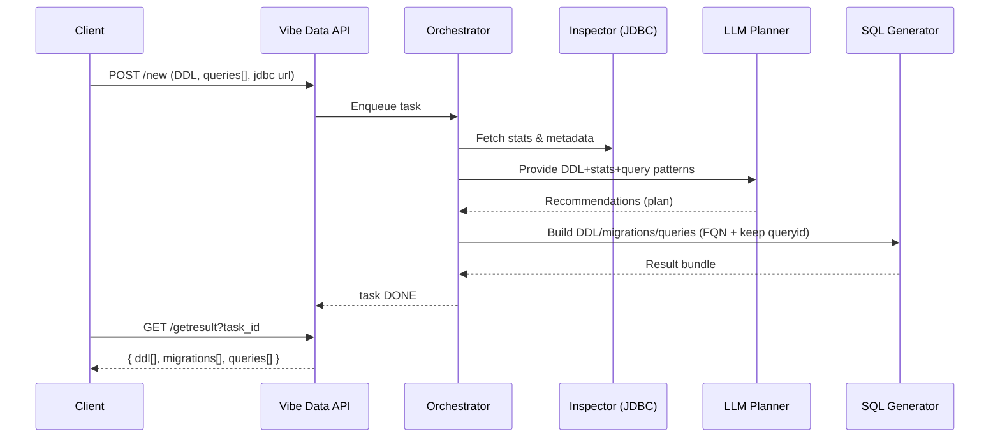

# Vibe Data — LLM-сервис оптимизации структуры БД и SQL-запросов

*Vibe Data* — это AI-агент, который принимает описание схемы данных, набор часто используемых SQL-запросов и строку подключения к источнику, анализирует паттерны запросов и статистику данных и возвращает рекомендации в виде нового набора DDL, миграций и переписанных запросов для ускорения аналитики и снижения стоимости хранения. Сервис разработан для работы в сценариях data lakehouse и традиционных СУБД.&#x20;

---

## Цели проекта

* Сократить среднее взвешенное время выполнения запросов за счёт рекомендаций по схеме (денормализация, партиционирование и т. п.) и переписыванию SQL.&#x20;
* Снизить объёмы хранения через изменения форматов/структур и миграции.&#x20;
* Автоматизировать трудоёмкую ручную оптимизацию за счёт применения LLM и встроенных эвристик.&#x20;
* Поддержать типичные lakehouse-стэки (S3/Iceberg/Trino/Spark) и JDBC-подключения, предоставляемые организатором.&#x20;

> **Важно:** все команды работы с таблицами в ответе сервиса должны использовать **полный путь** `<каталог>.<схема>.<таблица>`, а **первой DDL-командой** должна идти `CREATE SCHEMA` в нужном каталоге. Это правило также распространяется на все миграции и переписанные запросы.&#x20;

---

## Архитектура и стек

**Стек:** Java 21, Spring Boot 3, Spring AI, PostgreSQL, Docker/Docker Compose.

**Ключевые компоненты:**

1. **REST API** (Spring Boot): принимает задания, отдаёт статусы и результаты; OpenAPI-документация встроена.
2. **Оркестратор задач**: очередь/пул воркеров, транзакции и ретраи (PostgreSQL + Spring).
3. **Инспектор источника**: JDBC-модуль для чтения метаданных/примерной статистики (кардинальности/размеров). Для Trino использует предоставленную строку подключения.&#x20;
4. **Планировщик оптимизаций (LLM)**: Spring AI + промпт-шаблоны. Объединяет эвристики (join-graph, частоты, «горячие» агрегаты) и вывод LLM.
5. **Генератор SQL артефактов**: DDL новой схемы, миграции, переписанные запросы. Гарантирует FQN для таблиц и сохранение `queryid`.&#x20;
6. **Хранилище артефактов**: JSONB поля для входа/выхода, статусов и логов.

Диаграмма последовательности (схематично):



---

## API

Сервис обязан поддерживать следующий набор эндпойнтов и форматы, указанные в ТЗ.&#x20;

### Обзор эндпойнтов

* **POST `/new`** — запуск задачи анализа (асинхронно). На вход: `jdbc url`, `ddl[]`, `queries[]`. На выход: `taskid`.&#x20;
* **GET `/status?task_id=...`** — статус: `RUNNING` / `DONE` / `FAILED`. Для проверки задан **предел ожидания ответа** (см. ниже).&#x20;
* **GET `/getresult?task_id=...`** — получение результата: `ddl[]`, `migrations[]`, `queries[]`.&#x20;

> Для промежуточной/финальной сдачи: требуется доступный `endpoint` и соблюдение предельного времени ожидания ответа **15 минут**.&#x20;

### OpenAPI (YAML)

```yaml
openapi: 3.0.3
info:
  title: Vibe Data API
  version: "1.0"
  description: LLM-сервис оптимизации структуры БД и SQL
servers:
  - url: https://{host}
    variables:
      host:
        default: localhost:8080
paths:
  /new:
    post:
      summary: Запуск задачи анализа
      security:
        - ApiKeyAuth: []
      requestBody:
        required: true
        content:
          application/json:
            schema:
              $ref: '#/components/schemas/NewTaskRequest'
            examples:
              sample:
                value:
                  url: "jdbc:trino://trino.example:8080/hive/default?user=xxx&password=yyy"
                  ddl:
                    - statement: "CREATE TABLE cat1.public.t1 (id bigint, ...) ..."
                    - statement: "CREATE TABLE cat1.public.t2 (...) ..."
                  queries:
                    - queryid: "0197a0b2-2284-7af8-9012-fcb21e1a9785"
                      query: "SELECT a.id, b.x FROM cat1.public.t1 a JOIN cat1.public.t2 b ON ..."
                      runquantity: 123
      responses:
        "202":
          description: Принято
          content:
            application/json:
              schema:
                $ref: '#/components/schemas/NewTaskResponse'
        "400":
          description: Некорректный ввод
        "401":
          description: Нет доступа
  /status:
    get:
      summary: Статус задачи
      parameters:
        - in: query
          name: task_id
          required: true
          schema: { type: string, format: uuid }
      responses:
        "200":
          description: Текущий статус
          content:
            application/json:
              schema:
                $ref: '#/components/schemas/StatusResponse'
  /getresult:
    get:
      summary: Получение результата
      parameters:
        - in: query
          name: task_id
          required: true
          schema: { type: string, format: uuid }
      responses:
        "200":
          description: Результат анализа
          content:
            application/json:
              schema:
                $ref: '#/components/schemas/ResultResponse'
        "404":
          description: Не найдено
components:
  securitySchemes:
    basicAuth:
      type: http
      scheme: basic
  schemas:
    DdlStatement:
      type: object
      required: [statement]
      properties:
        statement: { type: string }
    QueryInput:
      type: object
      required: [queryid, query, runquantity]
      properties:
        queryid: { type: string }
        query: { type: string }
        runquantity: { type: integer, minimum: 0 }
    NewTaskRequest:
      type: object
      required: [url, ddl, queries]
      properties:
        url: { type: string, description: "JDBC URL" }
        ddl:
          type: array
          items: { $ref: '#/components/schemas/DdlStatement' }
        queries:
          type: array
          items: { $ref: '#/components/schemas/QueryInput' }
    NewTaskResponse:
      type: object
      properties:
        taskid: { type: string, format: uuid }
    StatusResponse:
      type: object
      properties:
        status:
          type: string
          enum: [RUNNING, DONE, FAILED]
    SqlBlock:
      type: object
      properties:
        statement: { type: string }
    RewrittenQuery:
      type: object
      required: [queryid, query]
      properties:
        queryid: { type: string }
        query: { type: string }
    ResultResponse:
      type: object
      required: [ddl, migrations, queries]
      properties:
        ddl:
          type: array
          items: { $ref: '#/components/schemas/SqlBlock' }
        migrations:
          type: array
          items: { $ref: '#/components/schemas/SqlBlock' }
        queries:
          type: array
          items: { $ref: '#/components/schemas/RewrittenQuery' }
```

**Замечания по совместимости с ТЗ:**

* Форматы ввода/вывода эквивалентны образцам ТЗ; сервис возвращает `taskid` на запуск.&#x20;
* Статусы строго: `RUNNING|DONE|FAILED`; при интеграционном чекере организаторов используется предельное ожидание на статус-вызов.&#x20;
* В `ResultResponse.queries[]` сохраняется исходный `queryid` — без этого запрос не будет проверен.&#x20;

### Примеры вызова

```bash
# Запуск задачи
curl -X POST https://{host}/new \
  -H 'Authorization: Basic ...' -H 'Content-Type: application/json' \
  -d @payload.json

# Проверка статуса
curl "https://{host}/status?task_id=6c12bd3f-80b1-4c0a-84ab-d3160d2e8f7a"

# Получение результата
curl "https://{host}/getresult?task_id=6c12bd3f-80b1-4c0a-84ab-d3160d2e8f7a"
```

---

## Алгоритм работы и требования к результату

1. **Сбор входа**: DDL (по таблицам), список запросов с частотами (`runquantity`) и `jdbc url`.&#x20;
2. **Инспекция данных**: подключение к источнику через JDBC (в т. ч. Trino) для оценки состава и структуры.&#x20;
3. **Анализ паттернов**: выделение часто соединяемых таблиц, дорогих агрегатов, а также типовых OLAP-шаблонов.&#x20;
4. **Планирование изменений (LLM + эвристики)**: предложения по денормализации/партиционированию/типам данных и переписыванию запросов.&#x20;
5. **Генерация артефактов**:

   * **DDL** с явным `CREATE SCHEMA` первым шагом и FQN для всех объектов,
   * **migrations** — перелив данных из оригинальных таблиц в новые,
   * **queries** — переписанные SQL с сохранённым `queryid`.&#x20;
6. **Валидация**: синтаксис, FQN-проверка, наличие `queryid`, базовая симуляция плана (по возможности).&#x20;

---

## Критерии оценки эффективности (метрики)

При проверке организаторы выполняют **DDL → migrations → запросы** в указанном порядке; измерение длительности ведётся по переписанным запросам, при этом **сохранение исходного `queryid` обязательно**.&#x20;

**Метрика времени** (x):

$$
x = \frac{\sum_{i=1}^{n} Q_i \cdot \frac{A_i}{T_i}}{\sum_{i=1}^{n} Q_i}
$$

где $A$ — исходное время, $T$ — время после изменений, $Q$ — частота, $n$ — число операций. При проверке действует таймаут **10 минут на запрос** (ошибка = 10 минут).&#x20;

**Метрика ресурсов** (y):

$$
y = \frac{S}{C}
$$

где $S$ — объём до оптимизации, $C$ — после.&#x20;

**Итоговая оценка** (z):

$$
z = x \cdot \sqrt[3]{y}
$$

Чем выше $z$, тем лучше.&#x20;

**Нефункциональные ограничения интеграции:** для внешних проверок установлен **предел ожидания ответа 15 минут** на endpoint. Для запроса статуса в ТЗ указано предельное ожидание, по истечении которого считается неудачей. &#x20;

---

## Контракты на выходные артефакты

* **DDL**:

  * Первая команда: `CREATE SCHEMA <каталог>.<новая_схема>`;
  * Все таблицы/индексы/материализованные представления — только с FQN.&#x20;
* **Migrations**:

  * Только FQN в `INSERT INTO ... SELECT ...` из старых таблиц в новые.&#x20;
* **Queries**:

  * Сохранить `queryid`; все обращения к новым таблицам — по FQN.&#x20;

---

## Модель данных сервиса

* `tasks(id uuid, status enum, created_at, updated_at, error text)`
* `task_input(task_id fk, payload jsonb)` — исходные `url`, `ddl[]`, `queries[]` (валидируются).
* `task_result(task_id fk, ddl jsonb, migrations jsonb, queries jsonb)` — готовый пакет.
* Индексы на `status, created_at` для выборок оркестратора.

---

## Безопасность и соответствие

* Аутентификация: http basic auth.
* Секреты JDBC не логируются; в БД хранятся шифрованно/редактированы.
* Валидация SQL на отсутствие DDL, не относящихся к целевой схеме миграции (allow-list).
* Ограничения по времени и памяти воркеров, отмена задач по таймауту (в т. ч. под внешние 15 минут интеграции).&#x20;

---

## Практические советы для интеграционного чекера

* **Чётко соблюдайте FQN и `CREATE SCHEMA` первым шагом** — иначе проверка не пройдёт.&#x20;
* **Сохраняйте `queryid`** в переписанных запросах — иначе запрос не будет засчитан.&#x20;
* Формируйте `migrations` так, чтобы минимизировать «встречки» (по возможности используйте insert-select с проекцией только нужных столбцов).
* Для lakehouse (Trino/Iceberg) учитывайте партиционирование и форматы файлов; для классических СУБД — индексацию и материализацию.
