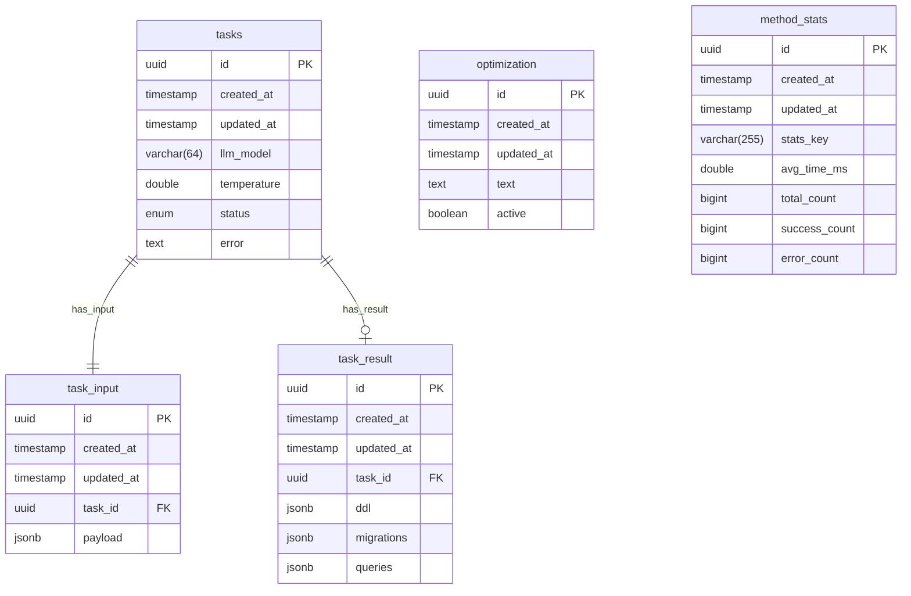

# Vibe Data — AI-агент для оптимизации SQL и DDL

**Vibe Data** — это ИИ-агент на базе LLM, который принимает описание схемы данных (DDL), набор часто выполняемых
SQL-запросов со статистикой и строку подключения JDBC, анализирует их и возвращает:

* новый набор DDL для улучшенной структуры,
* миграции (`INSERT ... SELECT ...`) для переноса данных,
* переписанные запросы (с сохранением `queryid`).

Основная цель — **ускорение аналитических запросов и снижение стоимости хранения** в lakehouse-стеке (Trino + Iceberg +
S3) и других СУБД.

---

## Контакты разработчиков

* Команда: Java Boys
* Рустам Курамшин — https://t.me/KuramshinRustam | 📞 +7 (952) 584-34-99
* Рустам Гулямов — https://t.me/gulyamovrustam | 📞 +7 (912) 321-88-19
* Александр Янчий — https://t.me/AlexYanchiy_ru | 📞 +7 (978) 127-77-34
* Рустам Зулкарниев — https://t.me/WerderR | 📞 +7 (919) 883-84-60

---

## Презентация

[Смотреть презентацию Vibe Data](./Java_Boys_Vibe_Data_Система_рекомендаций_по_оптимизации_производительности_Data_Lakehouse.pdf)

## Swagger / OpenAPI

[https://api.vibe-data.javaboys.ru/swagger-ui/index.html](https://api.vibe-data.javaboys.ru/swagger-ui/index.html)

---

## Цели и задачи

* Сокращение среднего времени выполнения запросов за счёт:

  * денормализации,
  * партиционирования и сортировки,
  * переписывания SQL.
* Снижение затрат на хранение через миграции и структурные изменения.
* Автоматизация работы DBA/Data Engineers с помощью LLM + эвристик.
* Поддержка требований ТЗ конкурса:

  * полный путь к объектам `<catalog>.<schema>.<table>`,
  * `CREATE SCHEMA` первым в DDL,
  * сохранение исходного `queryid`.

---

## Архитектура и стек

**Технологический стек:**
Java 21, Spring Boot 3, Spring AI, PostgreSQL, Docker, Trino JDBC, Redis, MinIO.

**Основные компоненты:**

1. **REST API** (Spring Boot): эндпойнты `/new`, `/status`, `/getresult`, `/api/v1/optimizations/*`, валидация DTO, OpenAPI-спека.
2. **Оркестратор задач**: JPA + PostgreSQL, статусы RUNNING/DONE/FAILED, асинхронная обработка (ThreadPool + @Async).
3. **LLM-агент (QueryOptimizerAgent)**:

   * сортировка запросов по весу (`runquantity * executiontime`),
   * итеративная оптимизация запросов,
   * использование инструментов `EXPLAIN LOGICAL`, `DISTRIBUTED`, `IO`, `ANALYZE`, `ANALYZE VERBOSE` через JDBC,
   * поддержка выбора модели (`llmModel`) и температуры (`temperature`),
   * встроенный тайм-менеджмент (бюджет времени на оптимизацию).
4. **Генератор артефактов**:

   * собирает новые DDL,
   * генерирует миграции,
   * формирует переписанные запросы.
5. **Хранилище**: таблицы `tasks`, `task_input`, `task_result` с JSONB для артефактов, таблица «рекомендаций оптимизации».
6. **Валидация (Validation)**:

   * локальная проверка оптимизированных DDL/SQL на стенде Trino + Iceberg,
   * сравнение результатов старых и новых запросов,
   * авто-фиксы при ошибках (через LLM).
7. **Кэширование Tool Calling**: Redis для EXPLAIN/ANALYZE, прогрев кэша при запуске задачи.
8. **Безопасность**: HTTP Basic Auth (логин/пароль задаются через окружение).
9. **Swagger/OpenAPI**: тестирование API локально и через docker-compose.

---

## API

### Эндпойнты

* **POST `/new`** — запуск задачи.
  Вход (минимальный пример):

  ```json
  {
    "url": "jdbc:trino://host:port?user=xxx&password=yyy",
    "ddl": [ { "statement": "CREATE TABLE ..." } ],
    "queries": [
      { "queryid": "uuid", "query": "SELECT ...", "runquantity": 10, "executiontime": 5 }
    ]
  }
  ```

  Вход (с управлением LLM):

  ```json
  {
    "llmModel": "gpt-4o",
    "temperature": 0.4,
    "url": "jdbc:trino://host:port?user=xxx&password=yyy",
    "ddl": [ { "statement": "CREATE TABLE ..." } ],
    "queries": [
      { "queryid": "uuid", "query": "SELECT ...", "runquantity": 10, "executiontime": 5 }
    ]
  }
  ```

  Примечание: допускается использовать JDBC URL без `/catalog/schema` в пути, при этом требования ТЗ к полным именам объектов `<catalog>.<schema>.<table>` соблюдаются на уровне DDL/SQL.

  Выход: `{ "taskid": "uuid" }`.

* **GET `/status?task_id=...`** — статус: `RUNNING | DONE | FAILED`.

* **GET `/getresult?task_id=...`** — результат:

  ```json
  {
    "ddl": [ { "statement": "..." } ],
    "migrations": [ { "statement": "INSERT ..." } ],
    "queries": [ { "queryid": "uuid", "query": "SELECT ..." } ]
  }
  ```

* **POST `/api/v1/optimizations/new`** — создать рекомендацию.
  Тело: `{ "text": "…" }`
  Ответ: `{ "id": "uuid" }`

* **POST `/api/v1/optimizations/{id}/activate`** — активировать рекомендацию.

* **POST `/api/v1/optimizations/{id}/deactivate`** — деактивировать рекомендацию.

* **GET `/api/v1/optimizations/{id}`** — получить рекомендацию.

* **GET `/api/v1/optimizations`** — список активных рекомендаций.

Активные рекомендации автоматически подмешиваются в системный промпт LLM.

---

### Ограничения ТЗ

* Таймаут на обработку задачи сервисом: **20 минут**.
* Проверка идёт строго в порядке: DDL → migrations → queries.

---

## Алгоритм работы

1. Получение входа: DDL, список запросов, jdbc url, параметры LLM.
2. Инспекция и сортировка запросов по весу.
3. Оптимизация каждого запроса через LLM и Trino EXPLAIN/ANALYZE (с кэшированием в Redis).
4. Генерация финальных DDL и миграций.
5. Локальная валидация (Trino + Iceberg).
6. Авто-фиксы через LLM при ошибках.
7. Сохранение результата и выдача клиенту.

---

## Схема БД



---

## Таймауты и тайм-менеджмент

* Общий бюджет времени: `processing.max-total-duration-ms` (по умолчанию 1 200 000 мс ≈ 20 мин).
* LLM: `llm.timeout-seconds` (env `LLM_TIMEOUT_SECONDS`, по умолчанию 60с).
* Trino (JdbcTemplate): `spring.jdbc.template.trino.query-timeout` (env `TRINO_QUERY_TIMEOUT`, по умолчанию 20с).

Агент динамически оценивает среднюю длительность LLM-запросов и завершает итерации заранее, чтобы уложиться в лимит.

---

## Запуск локально (docker-compose)

```bash
docker compose up -d
```

Доступ к сервисам:

* Vibe Data API: [http://localhost:8086](http://localhost:8086) (Swagger: /swagger-ui/index.html)
* Trino: [http://localhost:18080](http://localhost:18080)
* Redis: localhost:26379
* Postgres: localhost:25436 (БД vibedata)
* MinIO: [http://localhost:9000](http://localhost:9000) (Console: [http://localhost:9001](http://localhost:9001), admin/password)

---

## Конфигурация (ключевые параметры)

**LLM:**

* `llm.llm-model` — модель по умолчанию (gpt-4o)
* `llm.temperature` — температура по умолчанию (0.5)
* `llm.valid-models` — список допустимых моделей
* `llm.timeout-seconds` — таймаут запроса к LLM (сек)

**Trino/Tool Calling:**

* `spring.jdbc.template.trino.query-timeout` — таймаут JDBC (сек)

**Validation:**

* `validation.enabled` — включить/выключить валидацию
* `validation.max-attempts` — число авто-попыток (по умолчанию 3)

**Тайм-менеджмент:**

* `processing.max-total-duration-ms` — общий бюджет времени
* `processing.default-llm-avg-ms` — стартовая оценка средней длительности LLM (мс)

**Кэширование:**

* `spring.cache.type=redis`
* `spring.cache.redis.time-to-live=2h`
* `spring.data.redis.host/port/password`

---

## Безопасность

* Доступ к API защищён Basic Auth.
* Логин/пароль настраиваются переменными окружения:

  * `BASIC_AUTH_USERNAME`
  * `BASIC_AUTH_PASSWORD`

---

## Файл .env и переменные окружения

Сервис читает переменные окружения из файла .env (подключается в docker-compose через env_file: .env для контейнера vibe-data).

Минимально необходимые параметры для запуска:

- OPENAI_API_KEY — API‑ключ для Spring AI (OpenAI). Без него LLM‑агент работать не будет.
- BASIC_AUTH_USERNAME — логин для HTTP Basic Auth (доступ к API).
- BASIC_AUTH_PASSWORD — пароль для HTTP Basic Auth.

Опциональные параметры (имеют значения по умолчанию):

- TRINO_QUERY_TIMEOUT — таймаут JDBC-запроса к Trino в секундах (по умолчанию 20).
- VALIDATION_ENABLED — включить/выключить локальную валидацию DDL/SQL (по умолчанию true).
- VALIDATION_MAX_ATTEMPTS — число авто‑попыток исправления при валидации (по умолчанию 3).
- LLM_TIMEOUT_SECONDS — таймаут запроса к LLM в секундах (по умолчанию 60).
- PROCESSING_MAX_TOTAL_MS — общий бюджет времени на весь процесс, мс (по умолчанию 1 200 000 ≈ 20 мин).
- PROCESSING_DEFAULT_LLM_MS — стартовая оценка средней длительности LLM‑запроса, мс (по умолчанию 40000).

Примечание: в docker-compose эти переменные (кроме секретов из .env) уже заданы значениями по умолчанию.

Пример .env:

```
# обязательные
OPENAI_API_KEY=sk-...your_key...
BASIC_AUTH_USERNAME=javaboys
BASIC_AUTH_PASSWORD=change_me
